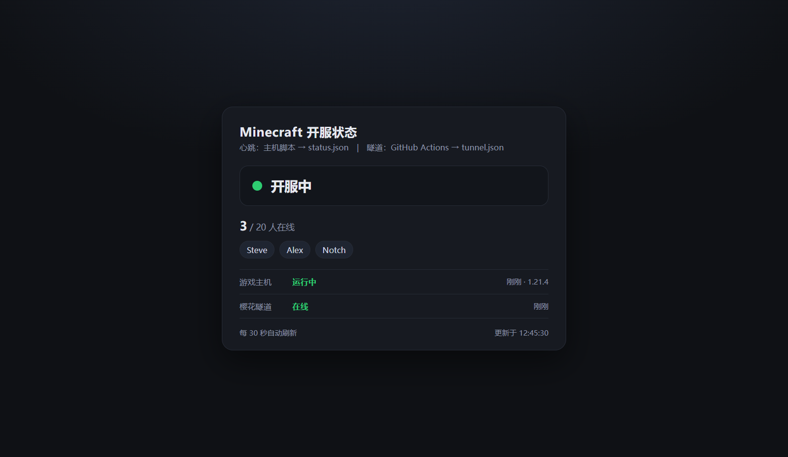

# mc-server-status · Minecraft 开服状态页

一个纯静态的 GitHub Pages 页面，实时显示**我现在是否开服**：开关状态、在线人数、玩家名；
左侧还有一块**主机面板**：电脑是否开机、CPU / 内存占用、开机时长。

> 玩法背景：第三方启动器 + 离线模式 + 局域网联机 + 樱花穿透（SakuraFrp）。
> 这个项目只做一件事——把"我开服了没有"这件事自动发布到网页上。

打开网址（把 `<用户名>` 换成你自己的）：

```
https://<用户名>.github.io/mc-server-status/
```



<sub>↑ 开服时的样子（用本地演示数据渲染，`node tools/demo-data.js online` 可复现）</sub>

## 左侧"我的电脑"面板

| 显示 | 含义 |
|---|---|
| 🟢 已开机 / 已开机 · 游戏中 | 心跳正常，电脑开着（游戏中会自动带"游戏中"） |
| 🔴 已关机 / 失联 | 超过阈值没收到心跳（游戏中 15 分钟、游戏没开时 40 分钟） |
| CPU / 内存 进度条 | 绿 <70%、黄 70–90%、红 >90% |
| 内存 x / y GB | 已用 / 总容量 |
| 开机时长 | 系统上次启动至今 |

数据由心跳脚本用 Windows CIM 采集（`Win32_OperatingSystem` 取内存与开机时间、
`Win32_PerfFormattedData_PerfOS_Processor` 取 CPU），纯本地读取，不装任何东西。

## 页面状态说明

| 显示 | 含义 |
|---|---|
| 🟢 开服中 | 游戏在开 **且** 樱花隧道在线，朋友能连（附人数 + 玩家名） |
| 🟡 游戏已开，隧道未开 | 游戏开着但穿透没开，朋友暂时连不上 |
| 🟡 隧道在线，游戏未开 | 穿透开着但游戏没开 |
| 🔴 未开服 | 游戏和隧道都没开 |
| ⚪ 主机失联 / 数据过期 | 页面之前显示在线，但心跳已停止更新（电脑关机 / 脚本没跑 / 游戏崩溃） |

## 架构

```
开服电脑 (PCL2 + 固定端口局域网世界)
  │
  ├─ 常驻监听进程（scripts/update_status.ps1 -Watch，登录时隐藏启动）
  │    ├─ 空闲每 10 秒 / 游戏中每 5 秒 ping 127.0.0.1:25565
  │    │    → 拿到 在线/人数/玩家名/版本，状态一变就立即上报
  │    ├─ 采样 CPU / 内存 / 开机时长（只在真正要上报时才读，避免常驻轮询 WMI）
  │    └─ 通过 GitHub API 写 status.json（无需安装 git）
  │
GitHub 仓库
  ├─ tunnel.json（隧道在线状态）：常驻进程每 5 分钟查樱花 API 后写入
  │    └─ 备用通道：.github/workflows/tunnel-check.yml（本仓库的 GitHub cron 实测不触发，默认不依赖它）
  └─ GitHub Pages 托管 index.html + status.json + tunnel.json
  │
访问者浏览器  →  每 30 秒拉取两个 JSON，合成最终状态
```

> 看门狗：Windows 任务计划每 30 分钟启动一次监听进程；进程内的互斥锁保证
> 已经在跑时直接退出，挂了才会被重新拉起。启动通过 `wscript.exe` + `run-hidden.vbs`
> 完成，**不会有任何控制台窗口闪出来**（直接用 powershell.exe 会闪）。
>
> 隧道状态：原本设计成由 GitHub Actions 的 cron 查询，但本仓库实测 **cron 一次都不触发**
> （工作流 `state=active` 也不跑），于是改由**常驻进程顺带查询**——樱花访问密钥本来就在本机。
> 工作流保留为备用通道：手动 Run workflow 是能正常工作的。

- **status.json**：由你的电脑写入（唯一能拿到真实人数和玩家名的来源）
- **tunnel.json**：由 GitHub Actions 写入（电脑关机时它仍在工作，用来交叉验证隧道）
- 两个文件分开写，避免两方同时改同一个文件造成冲突

## 仓库结构

```
mc-server-status/
├── index.html                      # 状态页（纯静态，无依赖）
├── status.json                     # 游戏状态（心跳脚本写入）
├── tunnel.json                     # 隧道状态（Actions 写入）
├── scripts/
│   ├── update_status.ps1           # ★ 主机心跳脚本（-Watch 常驻 / -SelfTest 自检）
│   ├── run-hidden.vbs              # 无窗口启动器（wscript 拉起常驻监听）
│   ├── register-task.ps1           # 装/卸 启动快捷方式 + 看门狗任务
│   ├── check_tunnel.mjs            # 查询樱花 API（Actions 调用）
│   └── host.config.example.json    # 主机配置模板（复制成 host.config.json）
├── tools/
│   ├── serve.js                    # 本地预览静态页
│   ├── mock-mc-server.js           # 假 MC 服务器（不开游戏也能测）
│   ├── test-heartbeat.js           # 自动测试心跳脚本
│   └── debug-ping.js               # 抓包调试（看客户端发了什么字节）
└── .github/workflows/tunnel-check.yml
```

## 部署步骤

### 一、GitHub 侧

1. 新建**公开**仓库 `mc-server-status`（免费版 Pages 需要公开仓库），把本项目所有文件推送到 `main` 分支。
2. **开启 Pages**：仓库 `Settings → Pages → Source: Deploy from a branch → Branch: main / (root) → Save`。
   稍等 1 分钟后访问 `https://<用户名>.github.io/mc-server-status/`，应能看到"未开服"页面。
3. **允许 Actions 写仓库**：`Settings → Actions → General → Workflow permissions` 选 **Read and write permissions**。
4. **配置樱花凭据**：`Settings → Secrets and variables → Actions`
   - `Secrets` 页 → New repository secret：`NATFRP_TOKEN` = 樱花**访问密钥**（SakuraFrp 面板里创建）
   - `Variables` 页 → New repository variable：`NATFRP_TUNNEL` = 隧道 **ID**（纯数字）或隧道名称
   - 不配也能跑，只是页面隧道状态显示"未配置"。
5. （可选）`Actions` 页 → 选中"樱花隧道状态检测" → Run workflow，手动验证一次。

### 二、主机侧（开服的那台电脑）

1. 把仓库下载/复制到本机（至少要有 `scripts/` 目录）。
2. 生成 **GitHub 令牌**：`GitHub → Settings → Developer settings → Personal access tokens → Fine-grained tokens`，
   只授权 `mc-server-status` 这一个仓库，权限只需 **Contents: Read and write**。
3. 复制配置并填写：
   ```powershell
   Copy-Item scripts\host.config.example.json scripts\host.config.json
   notepad scripts\host.config.json      # 填 owner / repo / token / serverPort
   # 还要填两个樱花字段：natfrpTunnel（隧道 ID 或名称）
   #                     natfrpTokenFile（访问密钥文件路径，默认 ..\.secrets\natfrp-token.txt）
   ```
   `host.config.json` 已在 `.gitignore` 里，**不会被提交**。
4. 先跑一次空测（不联网、不上报，只看能不能 ping 到游戏）：
   ```powershell
   powershell -ExecutionPolicy Bypass -File scripts\update_status.ps1 -DryRun
   ```
   脚本自检（不需要开游戏、不需要网络）：
   ```powershell
   powershell -ExecutionPolicy Bypass -File scripts\update_status.ps1 -SelfTest
   ```
5. 真实上报一次，然后去 GitHub 看有没有新提交：
   ```powershell
   powershell -ExecutionPolicy Bypass -File scripts\update_status.ps1 -Force
   ```
6. 安装常驻监听 + 看门狗（**不会有窗口闪出来**）：
   ```powershell
   powershell -ExecutionPolicy Bypass -File scripts\register-task.ps1
   # 查看状态： -Status     停止监听： -Stop     卸载： -Uninstall
   ```
   这一步做两件事：
   - 在**启动文件夹**放一个快捷方式 → 登录时静默拉起监听进程
   - 注册一个**每 30 分钟**的看门狗任务 → 监听进程万一挂了就自动重启
     （用 `-IntervalMinutes 10` 可以让恢复更快）

   装好后也可以手动立刻启动一次：`Start-ScheduledTask -TaskName 'MC-Server-Status-Heartbeat'`
7. （可选）**让 PCL2 帮忙加速**：如果你的 PCL2 版本支持"启动游戏后运行命令"（一般在 设置 → 启动选项 或版本设置里），
   填入下面这条，开游戏后状态会**立刻**变绿，而不用等下一次心跳：
   ```
   powershell -NoProfile -ExecutionPolicy Bypass -File "完整路径\scripts\update_status.ps1"
   ```
   不支持也没关系——定时任务最迟 1 分钟内也会发现开服。

### 三、端口必须固定

局域网联机默认是**随机端口**，樱花隧道和本脚本都需要一个固定端口，所以要用下面任一方案：

- 装"固定局域网端口"类 Mod（例如自定义局域网联机 / Lan Server Properties 一类），把端口固定成 25565；
- 或者干脆改用官方服务端 `server.jar` 开专用服（端口在 `server.properties` 里固定）。

然后确保：**樱花隧道指向 127.0.0.1:25565**，且 `host.config.json` 里的 `serverPort` 也是 25565。

## 心跳脚本参数

| 参数 | 默认值 | 说明 |
|---|---|---|
| `-DryRun` | — | 只 ping 并打印将要上报的 JSON，不碰 GitHub（安全测试用） |
| `-SelfTest` | — | 跑内置协议自检（VarInt 编解码、状态解析、玩家名），不联网 |
| `-Force` | — | 忽略"状态没变化"判断，强制上报一次 |
| `-Owner` / `-Repo` / `-Branch` | 配置/`mc-server-status`/`main` | 目标仓库 |
| `-Token` | `host.config.json` 或环境变量 `MC_STATUS_TOKEN` | GitHub 令牌 |
| `-ServerHost` / `-ServerPort` | `127.0.0.1` / `25565` | 要 ping 的 MC 服务器 |
| `-TimeoutMs` | `3000` | 单次连接/读取超时 |
| `-ProtocolVersion` | `767` | 握手用的协议号，一般不用改 |
| `-KeepAliveMinutes` | `10` | 在线期间最长多久刷新一次（防止刷提交） |
| `-MinPushIntervalMinutes` | `2` | 仅"玩家列表变化"时的最小推送间隔；开服/关服不受此限制，`0` = 不节流 |
| `-MachineKeepAliveMinutes` | `30` | 游戏**没开**时也定期上报一次（让电脑面板不显示旧数据；不想上报设很大值） |
| `-Watch` | — | 常驻模式：进程内循环探测，状态一变立刻上报（登录时由启动快捷方式拉起） |
| `-WatchFastSeconds` | `5` | 常驻模式下"游戏在线"时的探测间隔 |
| `-WatchIdleSeconds` | `10` | 常驻模式下"游戏没开"时的探测间隔 |
| `-TunnelCheckSeconds` | `300` | 常驻模式下多久查一次樱花隧道状态（写进 `host.config.json` 的 `tunnelCheckSeconds` 也行） |
| `-TunnelKeepAliveMinutes` | `30` | 隧道状态无变化时最长多久写一次 `tunnel.json` |
| `-ConfigPath` / `-LogFile` | `scripts/host.config.json` / `scripts/heartbeat.log` | 配置与日志路径 |

## 上报节流规则（为什么不会刷屏提交）

- 状态**变化**时立即上报（开服 / 关服 / 玩家进出）
- 在线期间：距上次上报超过 `KeepAliveMinutes`（默认 10 分钟）才再报一次
- 游戏**没开**时：每 `MachineKeepAliveMinutes`（默认 30 分钟）上报一次，让电脑面板保持新鲜
  （电脑关掉后心跳就停了，页面按上面阈值显示"已关机 / 失联"）
- 探测本身很轻（一个 TCP 连接）：空闲 10 秒一次、游戏中 5 秒一次，
  **不上报时完全不碰 GitHub API**，所以常驻进程几乎不产生流量
- 隧道侧：状态没变化时最多每 30 分钟写一次 `tunnel.json`

> ⚠️ 页面上的"数据过期"阈值（`index.html` 里的 `HEARTBEAT_STALE_MINUTES`，默认 **15 分钟**）
> 必须**明显大于** `KeepAliveMinutes`（默认 10 分钟），否则游戏中页面会误报"主机失联"。
> 改了一个记得同步改另一个。

## 本地测试工具

```powershell
# 不开游戏也能测：起一个假 MC 服务器（2 名玩家）
node tools\mock-mc-server.js 25566 Steve,Alex
# 另开一个终端，对着假服务器跑心跳
powershell -ExecutionPolicy Bypass -File scripts\update_status.ps1 -DryRun -ServerPort 25566

# 一键自动测（在线 + 离线两条分支）
node tools\test-heartbeat.js

# 本地预览状态页
node tools\serve.js            # 然后浏览器打开 http://127.0.0.1:8080
```

## 隐私与安全

- **令牌绝不进仓库**：`scripts/host.config.json` 已被 `.gitignore` 忽略；樱花密钥只放在 GitHub Secrets。
- **不公开连接地址**：`tunnel.json` 只写 `online / status / status_reason / name`，**不写**樱花的公网地址 `remote`。
  想给朋友看地址的话，自己私下发即可。
- 玩家名会显示在公开页面上：离线模式的昵称是自定义的，请别用真名/邮箱当游戏名。
- 离线模式服务器本身对知道地址的人开放，这是原有玩法决定的，本项目不改变这一点。

## 常见问题

| 现象 | 原因 / 处理 |
|---|---|
| 页面一直"未开服" | 去 GitHub 看 `status.json` 有没有新提交；没有就运行 `-DryRun` 看能否 ping 到游戏（端口对不对、局域网是否已开放） |
| 显示"主机失联 / 数据过期" | 心跳停了：电脑关机 / 游戏崩溃 / 监听进程被停。检查 `scripts\heartbeat.log` 和 `register-task.ps1 -Status`，需要时 `Start-ScheduledTask -TaskName 'MC-Server-Status-Heartbeat'` 重新拉起 |
| 屏幕上老是闪控制台窗口 | 已改成 `wscript.exe` + `run-hidden.vbs` 无窗口启动。如果又出现了，用 `register-task.ps1 -Status` 确认 Action 是 `wscript.exe` 而不是 `powershell.exe` |
| 常驻监听占多少内存 | 约 100 MB（一个 PowerShell 进程）。介意的话可以 `register-task.ps1 -Stop` 停掉，并把启动快捷方式删掉，只保留低频看门狗 |
| 隧道显示"未配置" | 没设 `NATFRP_TOKEN` / `NATFRP_TUNNEL` |
| Actions 提交失败（403） | `Settings → Actions → General → Workflow permissions` 要选 Read and write |
| 在线但玩家名是空的 | 服务器隐藏了玩家列表（多数公共服务器如此）。局域网世界一般能看到名字 |
| 开服后页面要等一会儿才变绿 | 心跳默认 1 分钟一次；想让显示更快，用上面 PCL2 启动后运行的方式 |
| 提交太频繁 | 调大 `host.config.json` 的 `keepAliveMinutes` 与工作流里的 `TUNNEL_KEEPALIVE_MINUTES` |

## 卸载

1. `powershell -ExecutionPolicy Bypass -File scripts\register-task.ps1 -Uninstall`（删定时任务）
2. 删除本地 `scripts\host.config.json`，并在 GitHub 上吊销那个令牌
3. 在 GitHub 上删除仓库（Pages 随之失效）
